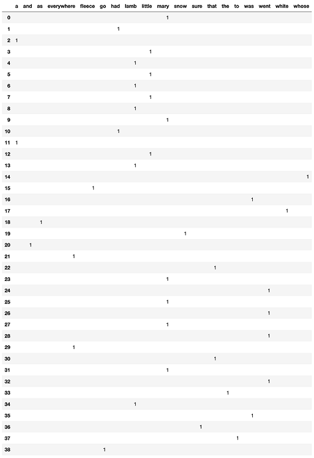

.. role:: raw-html(raw)
    :format: html

*****************
One Hot Encoding
*****************

Here, each term is expressed in a form of vector. The vector will have only one value as 1 while all others will be 0.

| **Example** -
| v1 = (0, 0, 0, 0, 1, 0, 0,⋯)T
| v2 = (0, 0, 0, 1, 0, 0, 0,⋯)T

:raw-html:` `

| **Limitations** :
| - Very sparse : only one element is 1
| - Contain no semantic information

